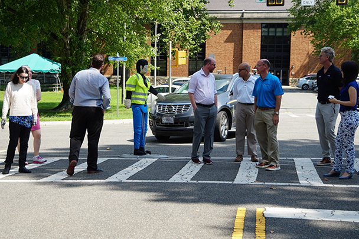

Quickly and accurately predicting conflicts between vehicles and vulnerable road users at intersections is no easy task, but this capability could transform intersection safety. To better understand the maturity of intersection safety systems with this capability and to encourage innovation, the U.S. Department of Transportation’s (U.S. DOT)** [Intersection Safety Challenge](https://www.its.dot.gov/isc/index.html)** (ISC) is moving ahead with Stage 1B: System Assessment and Virtual Testing.

In Stage 1A: Concept Assessment, competing teams submitted 120 innovative concepts for proposed intersection safety systems. The U.S. DOT [**announced**](https://www.transportation.gov/briefing-room/us-dot-announces-winners-intersection-safety-challenge) 15 winning teams at the Transportation Research Board Annual Meeting in January 2024. Each winning team received a prize of $100,000 and an invitation to participate in Stage 1B.

Now in Stage 1B, I am excited to see how these teams push the boundaries of two key technical elements of intersection safety systems operations: (1) the detection, localization, and classification of vulnerable road users and vehicles; and (2) path and conflict prediction among identified vulnerable road users and vehicles. To do so, the teams are using never-before-seen, U.S. DOT-supplied sensor data collected at a controlled intersection at the Turner-Fairbank Highway Research Center.

  

ITS JPO Director Brian Cronin, third from right, and colleagues participate in a data collection demonstration at a controlled intersection  
at the Turner-Fairbank Highway Research Center. The figure wearing a safety vest is a surrogate vulnerable road user.  
Source: U.S. DOT

Researchers collected data for Stage 1B over a series of months by staging various scenarios involving vehicles and vulnerable road users interacting at the intersection. *Please note that no one was harmed in the data collection process. *Surrogate vulnerable road users (i.e., pedestrian dummies) were used in some scenarios, especially when safety was a potential concern during simulations of near or actual collisions.Check out the video below that shows a few sample data runs at the controlled test intersection.

<iframe width="560" height="315" src="https://www.youtube.com/embed/csirVHFa2Cc?si=yYfLoosday6bGHRl&amp;enablejsapi=1&amp;origin=https%3A%2F%2Fwww.its.dot.gov" title="U.S. DOT Intersection Safety Challenge – Stage 1B Data Collection" frameborder="0" allow="accelerometer; autoplay; clipboard-write; encrypted-media; gyroscope; picture-in-picture; web-share" referrerpolicy="strict-origin-when-cross-origin" allowfullscreen="" data-gtm-yt-inspected-11586669_11="true" id="811607881" data-gtm-yt-inspected-10="true"></iframe>

As you can see in the video, the scenes contain different conflict and non-conflict situations, times of day, vulnerable road users, and props such as strollers and walkers. The U.S. DOT placed particular emphasis on collecting data with a variety of vulnerable road users and props, since they are often not well represented in currently available datasets.

While the video illustrates a few scenes from the perspective of a single visual camera at the intersection, these data contain a variety of other sensors as well, including a total of eight visual cameras, two lidars, four radars, and five thermal cameras. I am excited to see what the Stage 1B teams will accomplish in the coming weeks as they analyze, fuse, and use these multi-sensor data to train and refine their detection, classification, and prediction algorithms.

It is my hope that Stage 1B of the ISC with these multi-sensor data will allow the teams to demonstrate what is possible, help us better understand the deployment readiness of intersection safety systems, and inform next steps for the program, including potential prototype development and testing.
While the data are only currently available to the participating teams, U.S. DOT intends to make them publicly available in 2025 following the official close of Stage 1B. Please stay tuned as the ISC progresses in the coming months, and thank you for your continued engagement.

**Brian Cronin, Director, ITS JPO**