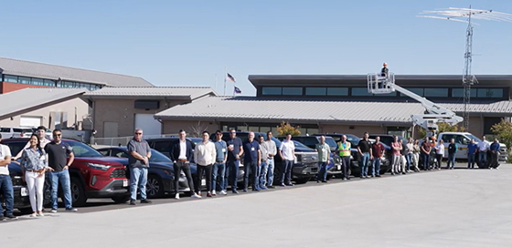

In October 2024, seven local, State, and Federal transportation agencies gathered in Cheyenne, Wyoming, to demonstrate the interoperability of vehicle-to-everything (V2X) applications and equipment, just two months after the U.S. Department of Transportation (U.S. DOT) released its [**National V2X Deployment Plan**](https://www.its.dot.gov/research_areas/emerging_tech/htm/Next_Landing.htm). This **first-of-its-kind demonstration**, coordinated by the Intelligent Transportation Systems Joint Program Office (ITS JPO), pointed to the **growing momentum** behind the Plan, which provides a blueprint for accelerating V2X deployment to enable safer, more efficient transportation.  

The four-day event attracted **broad participation** from 20 diverse stakeholders including automotive suppliers, test certification providers, security credential providers, mobile network operators, and public agencies from five states. They worked together in a spirit of **competitive collaboration** to test equipment, solve problems, and identify best practices that will enable interoperable deployment on a national scale. Kate Hartman, ITS JPO Chief of Research and Evaluation, and Justin Anderson, Next-Generation Wireless Communications Program Manager, spearheaded the event.

This milestone moment represents the first operational demonstration of interoperability across multiple V2X vendors since the Federal Communications Commission (FCC) clarified its rules on use of the 5.9 GHz band. Additionally, some participants were **looking beyond the 5.9 GHz band** to complementary spectrum. Among the approaches tested was a functioning mobile app.
The tests focused on traveler information messages, or TIMs, that can deliver time-sensitive information such as end-of-queue warnings, pedestrian collision warnings, weather alerts, variable speed limits, and work zone messages to drivers. This area of focus was a high priority for the Interoperability Technical Working Group that was formed as part of the National V2X Deployment Plan.

  

V2X interoperability testing participants gather at the Archer Test Track facility outside of Cheyenne, Wyo

In all, participants conducted approximately 50 tests, of which nearly 90 percent were successful. This **high success rate** is an encouraging sign that interoperability is an achievable goal. Of course, even the unsuccessful tests were valuable opportunities to troubleshoot issues on the spot and document the lessons learned. The testing also provided a **breakthrough for V2X security**, in that participants were able to demonstrate secure, interoperable communications across two different security credential providers.  

As the National V2X Deployment Plan emphasizes, interoperability is critical to the national deployment of V2X, which is why interoperability testing is so important. Collaborative testing is essential to ensure that V2X standards are clear and applied consistently. When issues arise, they can be proactively addressed before the devices are widely deployed. Check out the video below to learn more about the V2X interoperability testing conducted outside of Cheyenne, Wyo.  

<iframe width="560" height="315" src="https://www.youtube.com/embed/BTrlS1ZMv2M?si=hGBB_ArqI_XohfY0&amp;enablejsapi=1&amp;origin=https%3A%2F%2Fwww.its.dot.gov" title="Wyoming Interoperability Testing" frameborder="0" allow="accelerometer; autoplay; clipboard-write; encrypted-media; gyroscope; picture-in-picture; web-share" referrerpolicy="strict-origin-when-cross-origin" allowfullscreen="" data-gtm-yt-inspected-11586669_11="true" id="116464050" data-gtm-yt-inspected-10="true"></iframe>

In another sign of growing momentum, more than 30 organizations from around the world gathered at the OmniAir Plugfest in San Diego in late October to test a variety of cellular V2X (C-V2X) devices. Over 20 devices from more than a dozen vendors were tested for interoperability, standards conformance, security, and field performance. The goal of the testing was to ensure the readiness of C-V2X equipment for nationwide, interoperable deployment, consistent with the National V2X Deployment Plan. The event also provided an opportunity for engineers, software developers, and ITS experts to exchange knowledge and network. Technical learning sessions covered the latest on standards, new devices, performance testing, and more, including an update on the Wyoming interoperability testing from Justin Anderson.

That momentum carried forward into November as earlier this month, the Saving Lives with Connectivity: Accelerating V2X Deployment grant awardees in Arizona, Texas and Utah came together for a kickoff meeting in anticipation of their V2X deployments.  

As you consider where and how V2X can meet your transportation needs, I invite you to visit the [**ITS Deployment Evaluation website**](https://www.itskrs.its.dot.gov/). The ITS Deployment Evaluation program provides support for effective ITS decision-making through deployment data, cost and benefit analysis, and lessons learned.  

These recent events in Wyoming and San Diego are critical steps toward interoperability in support of the National V2X Deployment Plan, and more demonstrations are coming soon. As ITS technology evolves and V2X deployments continue to find success, the U.S. DOT is working with industry and other stakeholders to deploy V2X solutions nationwide. As the recent tests showed, secure interoperability is possible, and the U.S. DOT remains committed to realizing the lifesaving possibilities of V2X deployment. Together, we can create a safer and more reliable transportation network for all road users.  

### **Update on the FCC Final Rules for C-V2X**  

Late last week, the Federal Communications Commission (FCC) announced its adoption of C-V2X auto safety rules. In response, the U.S. DOT stated “technology plays a vital role in road safety and saving lives. FCC’s leadership in issuing the** [final rules](https://docs.fcc.gov/public/attachments/DOC-407683A1.pdf)** for cellular-vehicle-to-everything (C-V2X) technology accelerates deployment for public agencies and automotive manufacturers. CV2X technologies include crash avoidance to detect and avoid crashes, protect vulnerable road users, and reduce traffic congestion. FCC’s ruling both provides the certainty needed for industry to bring these life-saving technologies to market, and encourages public agencies to invest.

The U.S. Department of Transportation applauds the FCC’s decision and doubles down on its commitment to support the deployment of these technologies. This is a core part of our Vision Zero goal to eliminate road fatalities. The U.S. Department of Transportation collaborated with the NTIA, DoD, NASA, and NSF, to conduct a data-driven technical analysis to inform this decision, and is a key part of the DOT’s [**V2X Deployment Plan**](https://www.its.dot.gov/research_areas/emerging_tech/htm/ITS_V2X_CommunicationSummit.htm) and [**related deployment grants**](https://highways.dot.gov/newsroom/usdot-awards-nearly-60-million-advanced-vehicle-technology-grants-arizona-texas-and-utah).”

**Brian Cronin, Director, ITS JPO**