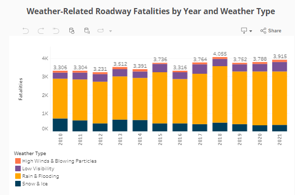
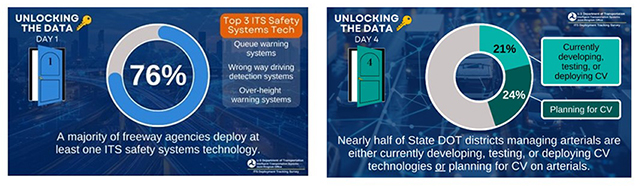

As we approach the end of the year, I wanted to share some exciting updates from the Intelligent Transportation Systems Joint Program Office’s (ITS JPO) Deployment Evaluation Program. The ITS JPO is, and has always been, a data-driven and data-focused organization. Our office collects and uses data to demonstrate the proven benefits of ITS in the lives of every American: life-saving benefits of improved roadway safety, time-saving and cost-saving benefits of reduced congestion, quality-of-life benefits from improved mobility and transportation accessibility, and economic benefits of improved transportation system efficiency overall, locally and nationally. I want to let you know about **two exciting data-focused products** that were recently made available on the [**Deployment Evaluation Program website**](https://www.itskrs.its.dot.gov/).

### ITS For Road Weather: New Data Story

One of the many ways the ITS JPO delivers data-driven insights on the value of ITS is through “data storytelling.” Just a few weeks ago, the Deployment Evaluation Program posted its second data story,** [ITS For Road Weather Safety](https://www.itskrs.its.dot.gov/decision-support/roadweather-datastory)**. 

At this time of year, many of us will be out on the roads visiting family and friends or finishing up some holiday shopping. Whether we are driving, taking transit, walking, or rolling, many of us may find ourselves in the midst of bad weather – including ice, snow, rain, fog, and high winds. Dangerous winter road conditions, combined with fewer daylight hours, can be a significant safety challenge. 

The ITS for Road Weather Safety Data Story uses the National Highway Traffic Safety Administration (NHTSA) Fatality and Injury Reporting System (FARS), the ITS JPO’s Benefits and Costs databases, and other sources to explore more deeply the roadway safety challenges posed by inclement weather and how ITS technologies, including vehicle-to-everything (V2X) technology, can be an effective tool to help address those challenges and save lives.

For example, NHTSA’s FARS data indicate that weather-related roadway fatalities have increased by about 18 percent since 2010, resulting in almost 4,000 deaths in 2021. ITS technologies show great promise in helping to bring that number down. In just one example, the Ohio Department of Transportation (ODOT) found that after installing variable speed limit signs, the number of crashes in snowy conditions on Interstate 90 declined by 21 percent, over a five-year period from 2014 to 2019.

  
**Source: Fatality Analysis Reporting Systems (FARS).Data pulled fromThe National Highway Traffic Safety Administration (NHTSA) June 2024**

### 2023 ITS Deployment Tracking Survey Now Available Online

Every three years or so, the ITS JPO looks forward to helping the ITS stakeholder community take a deep dive into the results from the most recent ITS Deployment Tracking Survey, which we’ve administered to freeway, arterial and transit agencies since 1999. We’re excited to report that the results from the most recent ITS Deployment Tracking Survey (administered in late 2023 through early 2024) were just released!

One aspect of this new survey we are very excited about is that it now addresses ITS deployment in **smaller urban and rural areas in addition to the nation’s most populous cities**. **As a result of this change, the 2023 ITS Deployment Tracking Survey provides a more complete picture of public sector ITS deployment across the U.S.** For more information on the 2023 ITS Deployment Tracking Survey, [**click here**](https://www.itskrs.its.dot.gov/decision-support/infographic/its-deployment-tracking-survey-geographic-coverage-expands).

As part of the ITS JPO’s effort to bring these recent survey results to you, we just completed a “*10 Days of Data*” campaign on [**LinkedIn**](https://www.linkedin.com/company/usdot-research-technology/posts/?feedView=all) and [**X**](https://x.com/ITS_USDOT) (#ITS10Daysof Data) that highlighted ten of the most significant findings from this recent survey. Here are a few highlights:

I encourage you to explore all of the data resources that the ITS JPO has to offer, including the ITS Benefit and Cost databases, ITS deployment statistics, and a wide variety of interactive charts, graphs, maps, infographics, data stories, and other decision support tools – all available online. To learn more about ITS Deployment Evaluation resources, visit the ITS Deployment Evaluation program [**website**](https://www.itskrs.its.dot.gov/) or contact Marcia Pincus, Program Manager, at [**marcia.pincus@dot.gov**](mailto:marcia.pincus@dot.gov).  

We believe in the power of data to tell good stories about how ITS solves problems worth solving, and to make strong business cases for ITS investment.
Have a wonderful holiday season and a happy (and safe!) New Year. I look forward to sharing more in the new year as we continue to create a safer and more reliable transportation network for all road users.
**Brian Cronin, Director, ITS JPO**