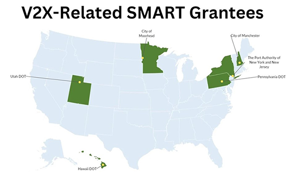

On December 16, the U.S. Department of Transportation (U.S. DOT) [**announced**](https://www.transportation.gov/briefing-room/investing-america-biden-harris-administration-announces-130-million-funding-scale) over $130 million in grant awards for 42 technology demonstration projects through the [**Strengthening Mobility and Revolutionizing Transportation (SMART) Grants Program**](https://www.transportation.gov/grants/SMART). I am excited to share that several of the awardees are planning to deploy vehicle-to-everything (V2X) technology, which is a powerful tool for improving safety and mobility on our nation’s roadways.

The SMART Program supports a variety of intelligent transportation systems (ITS) technology solutions. Here, though, I want to focus on the projects that feature V2X as they align with the U.S. DOT’s National V2X Deployment Plan ([**Saving Lives with Connectivity: A Plan to Accelerate V2X Deployment**](https://www.its.dot.gov/research_areas/emerging_tech/pdf/Accelerate_V2X_Deployment_FINAL.pdf)).

As you may recall from an [**earlier blog post**](https://www.its.dot.gov/communications/blogs/itsjpo_directors_blog_01.htm), the SMART Program provides grants to public-sector agencies for demonstration projects focused on advanced smart community technologies and systems to improve transportation efficiency and safety. Eligible projects may be in either Stage One (planning and prototyping) or Stage Two (implementation). Last week’s announcement marks the first time the program has awarded funding to projects in Stage Two.

  
Six of the recent SMART grant recipients plan to deploy V2X technology. Source: U.S. DOT

Here are a few of the recent awardees who are using, or planning to use, V2X:

- The Hawaii Department of Transportation plans to use smart infrastructure, AI-driven video analytics sensing systems, and real-time V2X communication to help vehicles, pedestrians, and bicyclists avoid collisions.
- The City of Moorhead, Minnesota, plans to deploy transit signal priority applications as part of a multifaceted effort to enhance safety, boost transit-time reliability, and improve equity through systemwide resiliency.
- The City of Manchester, New Hampshire, plans to integrate connected vehicle technology with advanced traffic signal management and other innovative approaches to reduce delays and emissions while improving safety and communications in a disadvantaged neighborhood.
- The Port Authority of New York and New Jersey plans to deploy cellular V2X technology to address chronic safety issues and traffic congestion on New York City’s Trans-Manhattan Expressway and George Washington Bridge.
- The Pennsylvania Department of Transportation plans to implement freight signal priority applications to address critical air quality issues and freight-related congestion in central Pennsylvania.
- In a Stage Two SMART project, the Utah Department of Transportation is testing connected intersections to verify that they will work with V2X safety applications in original equipment manufacturer (OEM) production vehicles in Utah, Georgia, Arizona, Texas, Florida, Michigan, and Ohio.

These promising new projects show that a growing number of state and local governments see V2X technology as a potential solution to their most pressing transportation challenges. Every new deployment brings us closer to a future where that potential is realized.
**Brian Cronin, Director, ITS JPO**