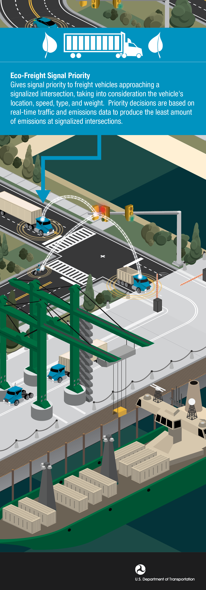

Gives signal priority to freight vehicles approaching a signalized intersection. Priority decisions are based on real-time traffic and emissions data to produce the fewest emissions at signalized intersections.

