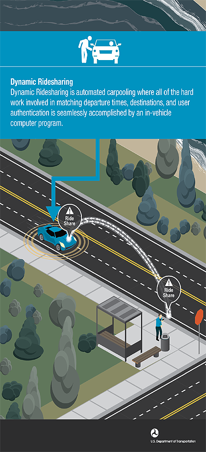

Dynamic ridesharing is automated carpooling where all of the hard work in matching departure times, destinations, and user authentications is seamlessly accomplished by an in-vehicle computer program.

