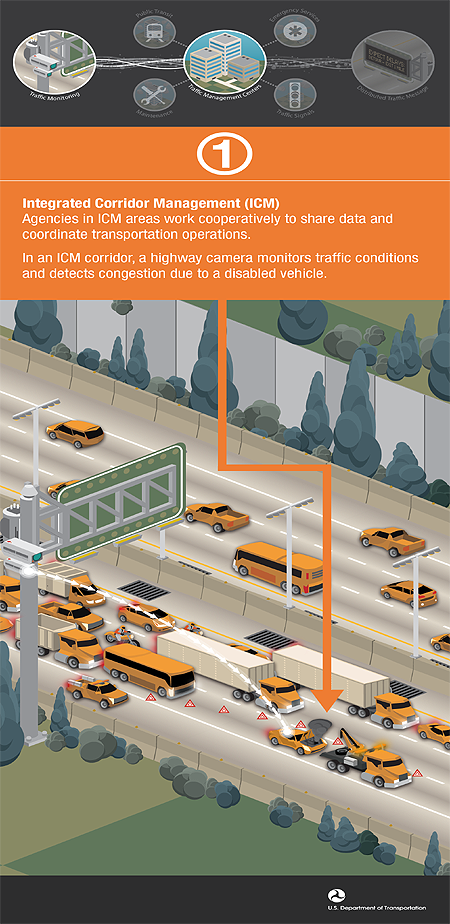
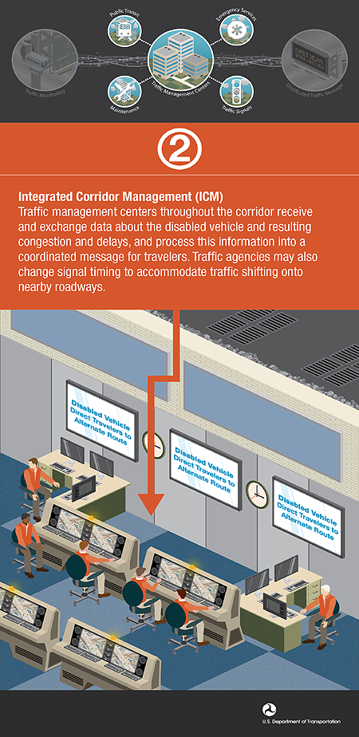
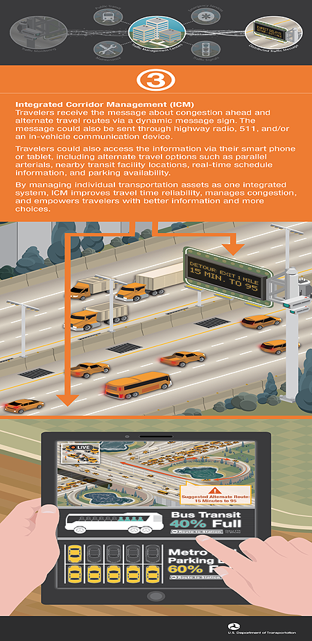

Agencies in ICM areas work cooperatively to share data and coordinate transportation operations. In an ICM corridor, a highway camera monitors traffic conditions and detects congestion due to a disabled vehicle.

Traffic management centers throughout the corridor receive and exchange data about the disabled vehcile and resulting congestion and delays, and process this information into a coordinated message for travelers. Traffic agencies may also change signal timing to accommodate traffic shifting onto nearby roadways.

Travelers recieve the message about congestion ahead and alternate travel routes via a dynamic message sign. The message could also be sent through highway radio, 511, and/or an in-vehicle communication device.

Travelers could also access the information via their smart phone or tablet, including alternate travel options such as parallel arterials, nearby transit facility locations, real-time schedule information, and parking availability.

By managing individual transportation assets as one integrated system, ICM improves travel time reliability, manage congestion, and empowers travelers with better information and more choices.

