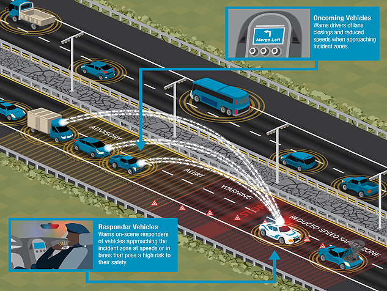

Response, Emergency Staging and Communications, Uniform Management, and Evacuation are the next generation of applications that transform the response, emergency staging and communications, uniform management, and evacuation (R.E.S.C.U.M.E.) process associated with incidents.

**Oncoming Vehicles** - Warns drivers of lane closing and reduced speeds when approaching incident zones.

**Responder Vehicles** - Warns on-scene responders of vehicles approaching the incident zone at speeds or in lanes that pose a high risk to their safety.

