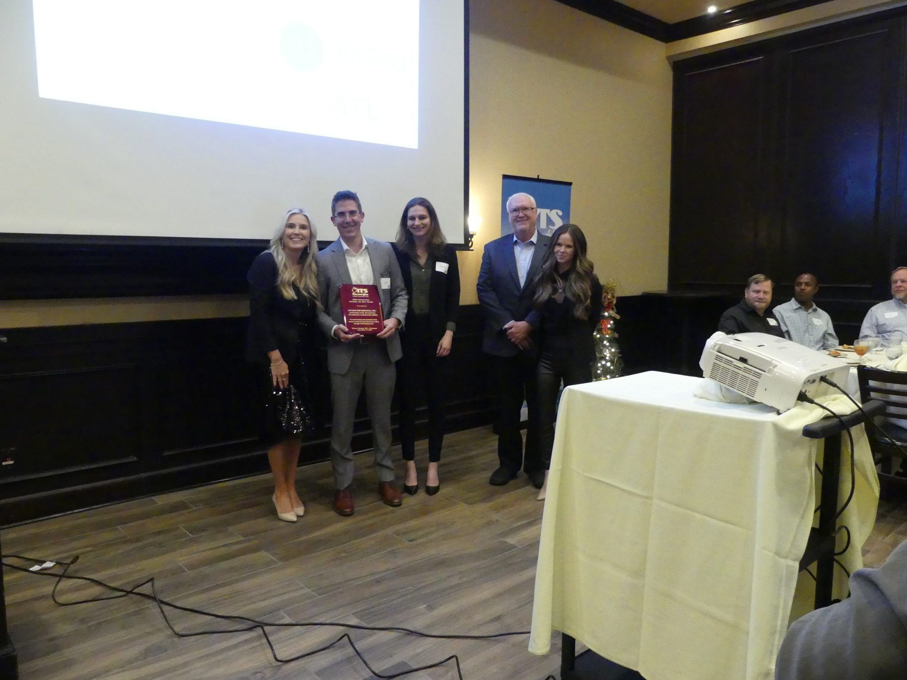
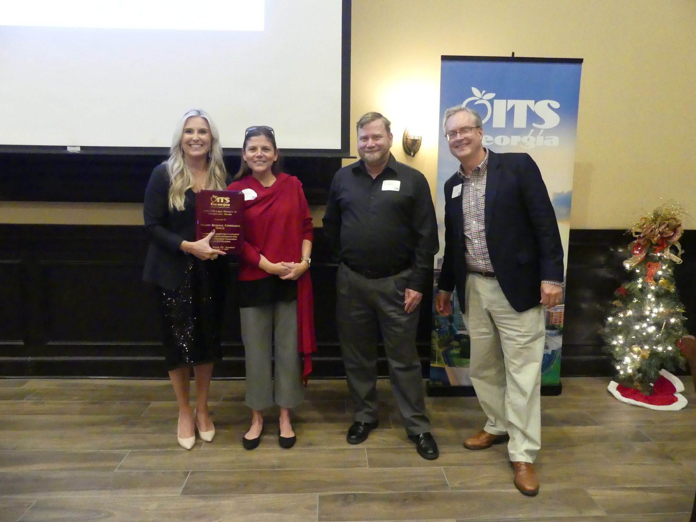
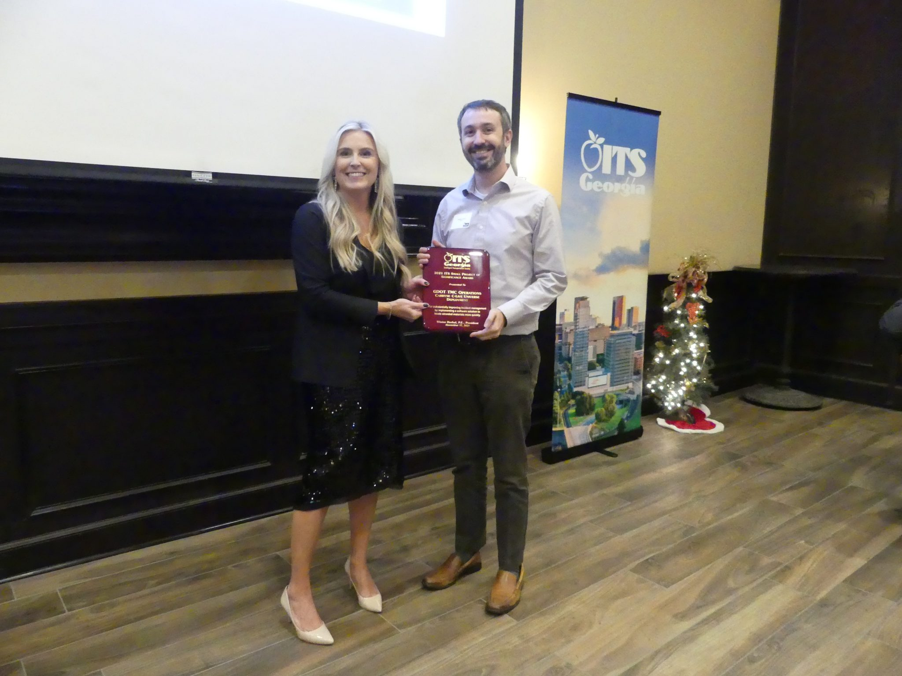
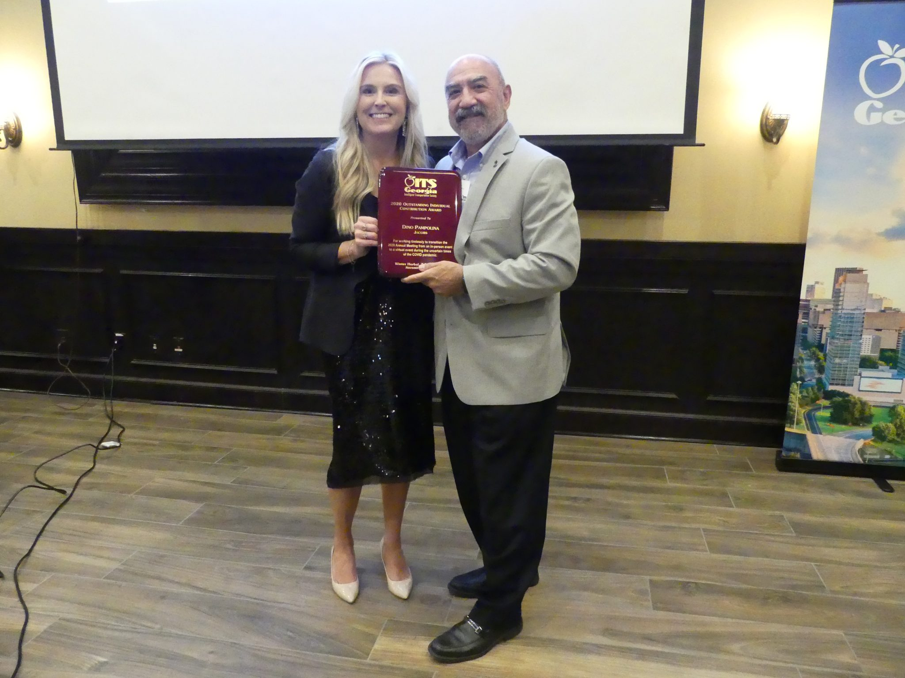
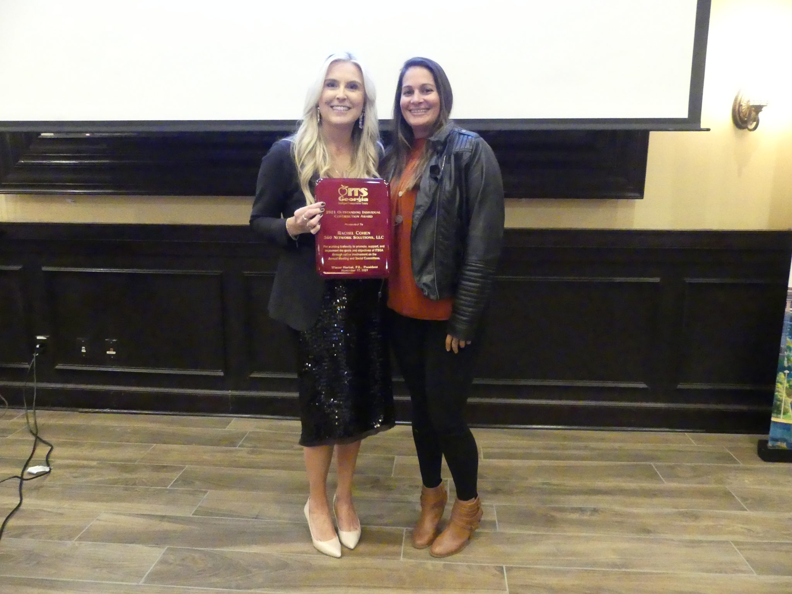
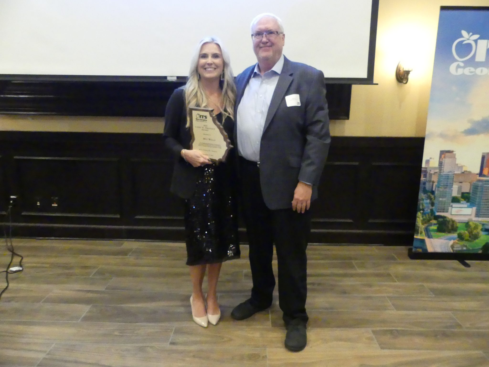

“Every year, ITS Georgia takes pride in recognizing the outstanding people, projects and organizations that make our state a leader in the development, deployment and operation of intelligent transportation systems,” said Winter Horbal, President of ITS Georgia. “This year, we are honored to be able to recognize the people and agencies who have contributed so much to our industry these past two years. Congratulations to all our winners.”

___

**The 2020-2021 Best of ITS Award Winners are:**

-   **2021 Innovation: Outside the Box Award** – Presented To: Applied Information, Inc. – Project: Infrastructure Automotive Technology Laboratory (iATL)
-   **2021 ITS Small Project of Significance Award** – Presented To: Georgia Department of Transportation’s TMC Operations – Project: Carbyne C-Live Universe Deployment
-   **2021 ITS Large Project of Significance Award** – Presented To: Atlanta Regional Commission – Project: ITS4US
-   **2021 Outstanding Agency Contribution Award** – Presented To: Georgia Department of Transportation’s Information Technology – Contributions: For working tirelessly to build the digital backbone that allowed GDOT to transition to 100% remote TMC operations at the onslaught of the COVID pandemic.
-   **2020 Outstanding Individual Contribution Award** – Presented To: Dino Pampolina of Jacobs – Contributions: For working tirelessly to transition the 2020 Annual Meeting from an in-person event to a virtual event during the uncertain times of the COVID pandemic.
-   **2021 Outstanding Individual Contribution Award** – Presented To: Rachel Cohen of 360 Network Solutions, LLC – Contributions: For working tirelessly to promote, support, and implement the goals and objectives of ITSGA through active involvement on the Annual Meeting and Social Committees.
-   **2021 Larry R. Dreihaup Award** – Presented To: Bill Wells of ITS Georgia – Contributions: For exemplifying professionalism and dedication in promoting ITS throughout your career and for over two decades of dedicated service and contributions to ITSGA.
-   **2020-2021 President’s Award** – Presented To: Thomas Glueckert, P.E., PTOE of Kimley-Horn – Contributions: For your tremendous support and dedicated service to ITSGA, not only as Treasurer, but in multiple other initiatives and leadership roles to ensure the chapter’s success year-after-year.

___

**About ITS Georgia**

The Intelligent Transportation Society of Georgia is a group of organizations that support Intelligent Transportation Systems (ITS) technology as a way to significantly reduce congestion and improve the performance, safety and efficiency of our transportation system.  ITS Georgia provides a forum for advocacy, facilitation, integration, and for learning more about ITS. ITS Georgia members include federal, state and local transportation agencies, ITS technology and service providers, large private and commercial transportation system users, universities, and other interested parties with missions that involve, or are affected by, the transportation system.  Visit www.itsga.org for more information.

       
