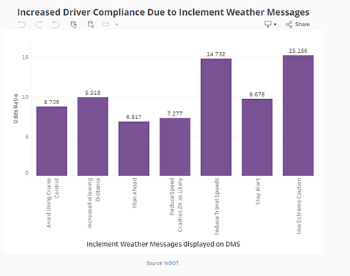
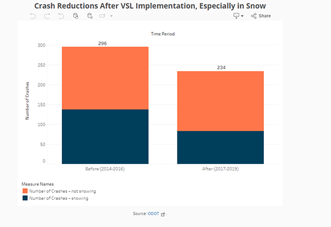

Adverse weather conditions such as snow, rain, fog, and ice can seriously affect driver and passenger safety, with substantial costs in loss of life, injuries, delays, and property damage. The U.S. Department of Transportation’s (U.S. DOT) ITS Joint Program Office has launched the** [ITS for Road Weather Safety Data Story](https://www.itskrs.its.dot.gov/decision-support/roadweather-datastory)** using interactive charts and maps to explore the challenges posed by inclement weather and how ITS technologies, including Vehicle-to-Everything (V2X) can be a valuable tool in addressing those challenges.

The data story uses data and information from the National Highway Traffic Safety Administration’s (NHTSA) Fatality and Injury Reporting System (FARS), the ITS Benefit, Costs, and Lessons Learned databases, and the ITS Deployment Tracking Survey to help users understand the challenges posed by adverse weather on roadway safety. It shows how ITS can be part of the solution, with links to U.S. DOT resources for addressing road weather safety.

Two examples showcasing the benefits of ITS technologies for improving safety during weather events are shown below. On the top chart, the Michigan DOT found that after implementing Dynamic Message Signs (DMS), drivers who found these messages useful in bad weather were 6.8 to 15.2 times more likely to alter their behavior. On the bottom chart, the Ohio DOT found that after installing Variable Speed Limits, or VSLs, the number of crashes declined by 21 percent, from 296 to 234.

  
**Figure 2**: Increased Driver Compliance Due to Inclement Weather Messages on DMS in Michigan

  
**Figure 3**: Crash Reductions After VSL Implementation in Ohio

The ITS Deployment Evaluation website provides short summaries of benefits, costs, and lessons learned from the safety, mobility, and environmental impacts of over 25 years of deployment of ITS technologies. The site contains data on the extent of ITS deployment obtained from surveys of state and local agencies over the last 20 years. It also offers briefings, case studies, data visualizations, and tools to support decision making for ITS investments. You can visit the website homepage here: [**ITS Deployment Evaluation (dot.gov)**](https://www.itskrs.its.dot.gov/)