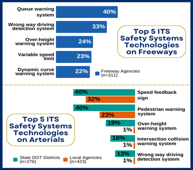

Which intelligent transportation systems (ITS) technologies are most commonly deployed on our nation’s freeways, arterials, and on transit and where is there room for growth? The Intelligent Transportation Systems Joint Program Office (ITS JPO) just released the [**2023 ITS Deployment Tracking Survey reports and data**](https://www.itskrs.its.dot.gov/deployment/2023DTS) on public sector ITS deployment to provide insight on these questions and more.

The ITS JPO’s ITS Deployment Tracking Survey has been administered regularly since 1999 and documents ITS adoption by freeway, arterial, and transit management agencies in the nation’s most populous cities. However, in 2023, **the geographic coverage of the survey was expanded to also include smaller urban and rural areas nationwide**. As a result, the 2023 ITS Deployment Tracking Survey now provides a more complete picture of public sector ITS deployment across the U.S. For more detailed information on the 2023 ITS Deployment Tracking Survey methodology and how it has changed, [**click here**](https://www.itskrs.its.dot.gov/decision-support/infographic/its-deployment-tracking-survey-geographic-coverage-expands).

The 2023 ITS Deployment Tracking Survey includes a wide range of questions on ITS deployment. The chart below shows the top 5 ITS safety systems technologies deployed by freeway management agencies, as well as the top 5 ITS safety systems technologies deployed by arterial management agencies.

To learn more about the deployment of ITS by freeway, arterial, and transit management agencies, please visit** [Deployment Statistics | ITS Deployment Evaluation](https://www.itskrs.its.dot.gov/deployment)** where you can find the full reports, as well as survey instruments, and raw data for the 2023 ITS Deployment Tracking Survey.

Reports, data, and survey instruments for past ITS Deployment Tracking Surveys (1999-2020) as well as for Special Topic Deployment Surveys are also available on the ITS Deployment Evaluation Program website, along with detailed data on ITS benefits and costs. It also offers briefings, case studies, infographics, interactive data visualizations, and other resources to support decision making for ITS deployment. You can visit the ITS Deployment Evaluation Program website homepage here: [**ITS Deployment Evaluation (dot.gov)**](https://www.itskrs.its.dot.gov/)