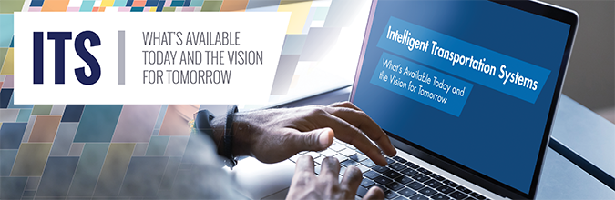

The Intelligent Transportation Systems (ITS) Joint Program Office (JPO) has released a new video highlighting the current and future states of ITS solutions and technologies.

For 30 years, the ITS JPO program has funded and coordinated innovative projects that have successfully deployed advanced ITS technologies across the nation. These ITS solutions have saved lives, improved mobility, and increased the efficiency of the nation’s transportation system. The video shines a spotlight on several of these solutions as well as offers a glimpse of the ITS JPO’s vision for the future of ITS.

As the ITS JPO looks ahead to the future of transportation, the program remains committed to advancing innovative transportation technologies that benefit all Americans—with a focus on addressing transportation’s impact on critical issues such as public health, job creation, social equity, and climate change.

Check out the [video](https://youtu.be/yQE5cI7ZWec) to take a look at what’s available for ITS today and preview the vision for tomorrow.

<iframe width="560" height="315" src="https://www.youtube.com/embed/yQE5cI7ZWec?enablejsapi=1&amp;origin=https%3A%2F%2Fwww.its.dot.gov" title="Intelligent Transportation Systems: What’s Available Today and the Vision for Tomorrow" frameborder="0" allow="accelerometer; autoplay; clipboard-write; encrypted-media; gyroscope; picture-in-picture" allowfullscreen="" data-gtm-yt-inspected-11586669_11="true" id="569241958" data-gtm-yt-inspected-10="true"></iframe>

_Posted 7/15/21_
