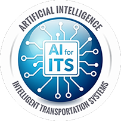

The U.S. Department of Transportation (U.S. DOT) Intelligent Transportation Systems (ITS) Joint Program Office (JPO) is pleased to announce its first webinar on the Artificial Intelligence (AI) for ITS Program. The [**AI for ITS Program Overview webinar**](https://www.eventbrite.com/e/artificial-intelligence-ai-for-its-program-webinar-registration-149718290437 "AI for ITS Program Overview webinar") aims to build program awareness and obtain public input by informing stakeholders and interested parties of the program’s research efforts, progress, and next steps. The webinar will be held on Wednesday, May 12, from 1:00 PM to 2:30 PM EST.

### Webinar Background

The AI for ITS Program’s vision is to advance next-generation transportation systems and services by leveraging trustworthy, ethical AI (including machine learning) for safer, more efficient, and accessible movement of people and goods. The program’s goal is to cost-effectively build and deploy AI for ITS capabilities in real-world modal use. Therefore, the U.S. DOT anticipates a future research and development investment for multiple pilot deployments.

### Webinar Details

This webinar is part of a series of webinars the U.S. DOT is hosting related to AI for ITS. The first webinar in the series aims to raise awareness of the AI for ITS Program, its past accomplishments, and future efforts. Specifically, the 90-minute webinar will:

-   Summarize completed program activities and outcomes and how those are being used to shape the future of the program
-   Raise awareness of publicly available documents based on the program’s past 18 months of research in AI for ITS
-   Share information on anticipated next steps for the program
-   Discuss the upcoming Request for Information on AI for ITS.

[**Register**](https://www.eventbrite.com/e/artificial-intelligence-ai-for-its-program-webinar-registration-149718290437) for this webinar to hear from program leaders who are breaking new ground in AI for ITS.

We encourage all attendees to review the readahead materials in advance of the webinar. They are accessible via the registration site, as well as the ITS JPO website:

-   **[AI for ITS Program Fact Sheet: Real-World AI Scenarios in Transportation for Possible Deployment](https://www.its.dot.gov/factsheets/pdf/AIforITS_Program_Factsheet_RealWorld_AI_Scenarios_in_Transportation_D4.pdf)**
-   **[AI for ITS Program Fact Sheet: Potential Application of AI in Transportation](https://www.its.dot.gov/factsheets/pdf/AIforITS_Program_Factsheet_RealWorld_AI_PotentialApps_in_Transportation_D4.pdf)**

Stay tuned to the ITS JPO’s [Emerging and Enabling Technologies web page](https://www.its.dot.gov/research_areas/emerging_tech/index.htm) and ITS JPO email announcements to learn more about upcoming webinars.

**SUMMARY**

**Title:** AI for ITS Program Overview  
**Date:** Wednesday, May 12, 2021  
**Time:** 1:00 PM to 2:30 PM EST  
**Registration: [Register Here](https://www.eventbrite.com/e/artificial-intelligence-ai-for-its-program-webinar-registration-149718290437)**

For more information on the AI for ITS Program, please visit the ITS JPO’s [Emerging and Enabling Technologies web page](https://www.its.dot.gov/research_areas/emerging_tech/index.htm).
