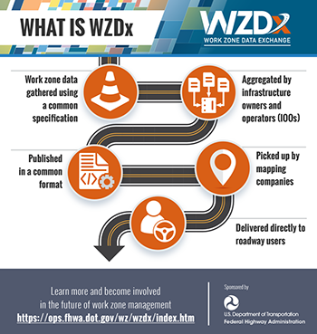

Join the Federal Highway Administration (FHWA) for a webinar to learn about the advent, progress, and future of the Work Zone Data Exchange (WZDx) project.

### Webinar Background

As a complementary effort to [National Work Zone Awareness Week](https://ops.fhwa.dot.gov/wz/outreach/wz_awareness.htm "National Work Zone Awareness Week"), FHWA is working to increase work zone safety through the Work Zone Data Exchange (WZDx), an open-source data specification that facilitates the collection of live, accurate, and actionable work zone data by transportation agencies and sharing among third parties, such as mapping companies.

That means smarter roads where navigation systems, drivers and eventually automated vehicles can be informed about work zones in their path, improving roadway safety nationwide. Work zone data can also help inform agencies who are responsible for integrating Transportation Systems Management and Operations strategies. To encourage adoption of WZDx, FHWA launched the “Put Work Zones on the Map” campaign — an effort to raise awareness about WZDx and engage potential partners, including:

-   State and local departments of transportation
-   Construction companies
-   Mapping companies
-   Vehicle and vehicle technology manufacturers

WZDx is a mutually beneficial response to an identified need for more actionable, accessible and timely work zone data. This webinar will provide a comprehensive look into the current status of the WZDx project, the need for safer work zones and open-source data, how state and local agencies are implementing the WZDx Specification, current efforts to spur adoption nationwide, and how to get involved.

### You Are Invited

We encourage people and organizations responsible for work zones to attend this webinar. This may include:

-   State and local DOTs
-   Contractors, smart work zone vendors, data producers and mapping companies
-   Vehicle and vehicle technology manufacturers
-   Anyone interested in the future of work zone safety and technology

### Highlights from this Webinar will include:

-   A definition of “work zone event data” and how is it integral to managing work zone activity on roadways
-   Information about WZDx and a description of how it functions as a mechanism for simplifying collection and communication of work zone event data
-   Benefits of a national strategy for managing work zone event data and an outline of Federal initiatives like the Work Zone Data Initiative (WZDI)
-   Discussion of pilot projects funded through U.S. DOT demonstration grants
-   An introduction to the _Put Work Zones on the Map_ awareness and partnership campaign
-   How to get involved with WZDx, the benefits of involvement and available resources such as the Work Zone Data Working Group

### Summary

**Title:** Work Zone Data Exchange Update Webinar  
**Date:** April 29, 2021  
**Time:** 12:00 p.m. – 1:30 p.m. ET  
**Presenters include representatives from:**  
Federal Highway Administration, Volpe National Transportation Systems Center, ITS America/CIG Communications and a WZDx Demonstration Grant Program Project  
**Registration:** [https://wzdxupdatewebinar.eventbrite.com](https://wzdxupdatewebinar.eventbrite.com/)

To learn more about Work Zone Data Exchange, visit: [https://ops.fhwa.dot.gov/wz/wzdx/index.htm](https://ops.fhwa.dot.gov/wz/wzdx/index.htm)

For more information on National Work Zone Awareness Week, visit: [https://ops.fhwa.dot.gov/wz/outreach/wz\_awareness.htm](https://ops.fhwa.dot.gov/wz/outreach/wz_awareness.htm)
