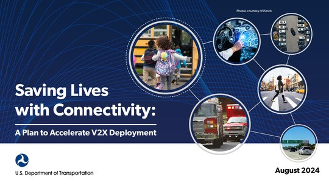

We are excited to share our vision for the future of transportation, one that promises to transform the way we travel: the era of connectivity via vehicle-to-everything (V2X) technology.

On August 16, 2024, the U.S. Department of Transportation (USDOT) released the [**National V2X Deployment Plan**](https://www.its.dot.gov/research_areas/emerging_tech/pdf/Accelerate_V2X_Deployment_FINAL.pdf) to accelerate the deployment of V2X technology. The Plan is one aspect of the Department’s broader commitment to reduce the number of roadway fatalities to the only acceptable number: zero. The National V2X Deployment Plan seeks to reduce uncertainty among all stakeholders working towards a shared vision of a nationwide, secure interoperable V2X ecosystem by setting USDOT’s vision, goals, and milestones, and issuing a formal call to action for stakeholders, including the USDOT, public agencies, and the private sector.​ 

Source: USDOT

The USDOT is seeking realized operational interoperability in the field among 12+ deployments by 2028 that inform a national reference implementation, eventually growing into a cadre of 50+ mature, interoperable deployments by 2036. ​With this Plan, the USDOT commits to modernizing and transforming the future of transportation both for today and for tomorrow. 

However, we cannot embrace this vision without everyone doing their part. The Department has shown its commitment to V2X by including it as part of the National Roadway Safety Strategy. Since the first V2X Summit held in 2022, we have been working actively and dedicating resources to gather data, collect stakeholder feedback, and develop a plan. We plan to keep the momentum going by:

* Providing seed funding and investment to accelerate V2X deployments.
* Convening and facilitating stakeholders to share information and best practices.
* Providing support for standards, architecture, and testing to accelerate interoperability.

You can learn more about how to get involved and stay up to date on progress on achieving this vision by visiting the USDOT’s [**V2X Program page**](https://www.its.dot.gov/research_areas/emerging_tech/htm/Next_Landing.htm) or by sending a message to [**V2XDeploymentPlan@dot.gov**](mailto:V2XDeploymentPlan@dot.gov).

Thank you for your continued support. Together, we are paving the way for a safer, more efficient future of travel.

Posted 8/28/24