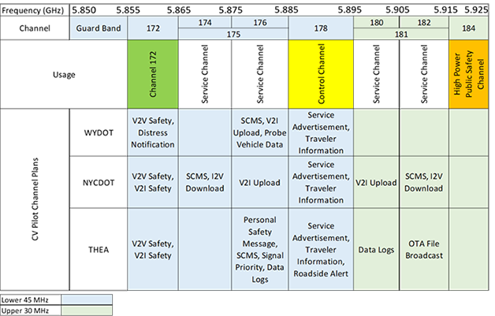

The USDOT Intelligent Transportation Systems (ITS) Joint Program Office (JPO) Connected Vehicle (CV) Deployment Program deployment sites have implemented a wide range of vehicle-to-vehicle (V2V) and vehicle-to-infrastructure (V2I) ITS applications. These applications included safety applications such as forward collision warning (FCW) and red light violation warning (RLVW) and support applications such as data collection, device software updates and secure credential management system (SCMS) communications. In order to support all of these applications, and ensure they work reliably, the support applications need to utilize a separate channel from the safety applications. When multiple roadside units (RSU) are deployed with overlapping wireless coverage areas, such as in downtown Manhattan, infrastructure applications must also be distributed across different channels to minimize interference between RSUs.

Prior to the release of a Federal Communications Commission (FCC) Report and Order on May 3, 2021, the connected vehicle technology deployers had all 75 MHz of the 5.9 GHz Transportation Band to utilize to support their communications needs. This allowed for the use of seven 10 MHz channels, with Channel 172 reserved for safety applications, Channel 178 used as the Control Channel for advertising different applications available at RSUs and Channel 184 reserved for high power public safety applications such as emergency vehicle notifications and signal preemption. Figure 1 provides the overview of the channel usage for each of the CV Pilot programs. As is shown, all of the channels, with the exception of the high power public safety channel, were utilized in order to reliably support these services. NYCDOT overcame challenges planning the allocation of services across RSUs as they have many locations with multiple overlapping RSU coverage areas. With the recent FCC 5.9 GHz Report and Order, which reduces the Transportation Band from 75 MHz to 30 MHz, significant additional challenges related to providing all needed services with reduced spectrum allocation are expected.

**Figure 1 - CV Pilots DSRC Channel Utilization**
