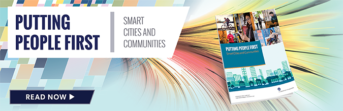

The U.S. Department of Transportation (U.S. DOT) has released the [Putting People First – Smart Cities and Communities](https://www.its.dot.gov/smartcities/SmartCities.pdf) report. The report covers the benefits, goals, challenges, and success factors associated with smart cities and communities (SC&C) and gives a glimpse of the path forward.

### Background

SC&Cs use advanced information and communications technologies to find new ways to solve age-old problems like potholes and pollution, traffic and parking, public health and safety, and equity and public engagement. SC&Cs create an intelligent and integrated information network by applying sensors and wireless communications technologies to infrastructure, vehicles, wearables, and any number of physical devices. They use this network to receive, analyze, and share data in real time to make better decisions and provide more responsive, efficient, and data-driven services. These bold new solutions have the potential to change the face of transportation by closing the gap between rich and poor, capturing the needs of both young and old, and bridging the digital divide through smart design so the future of transportation meets the needs of all.

### Report Overview

The Putting People First – Smart Cities and Communities report outlines the three hallmarks for establishing an SC&C:

-   **Networks:** They use networks of sensors to gather and integrate data that can be used for various applications and citizen services.
-   **Connectivity:** They use connectivity to enable city officials to interact directly with the community and to monitor and manage city infrastructure.
-   **Open Data:** They are committed to an open data philosophy and routinely share operations and planning data with the public.

In addition, the report highlights some of the forward-thinking ways that communities are applying SC&C concepts along with how the U.S. DOT is supporting those efforts. It shares results from a survey of more than 50 American cities on their use of SC&C technologies. The report also provides an overview of the benefits and challenges of SC&Cs and the key factors that can drive success. The report gives a glimpse of what the future might hold and how the U.S. DOT is helping communities blaze the way to a brighter future.

### Moving Forward

Over the course of the next year, the U.S. DOT will support a series of webinars and listening sessions on SC&Cs. These webinars will provide an opportunity to share best practices and lessons learned, with the goal of creating a sustainable coalition of communities that can support further implementation of effective SC&C initiatives.

To download the full report, visit [https://its.dot.gov/smartcities/SmartCities.pdf](https://www.its.dot.gov/smartcities/SmartCities.pdf).
