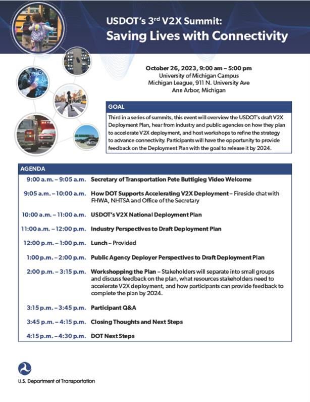

The agenda for the third U.S. Department of Transportation (USDOT) Vehicle-to-Everything (v2X) Summit is now available! The agenda includes topics, breakout sessions, and speakers from USDOT, industry, and State/local DOTs. Find the agenda and more information here: [V2X Communications Summit (dot.gov)](https://www.its.dot.gov/research_areas/emerging_tech/htm/ITS_V2X_CommunicationSummit.htm)

