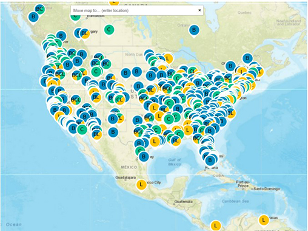

The U.S. Department of Transportation’s (U.S. DOT) Intelligent Transportation Systems Joint Program Office (ITS JPO) has launched a new map feature for visualizing the locations of ITS benefits, costs, and lessons learned: [ITS Map | ITS Deployment Evaluation (dot.gov)](https://www.itskrs.its.dot.gov/its-map).

The new fully searchable feature allows users to see where ITS technologies have been successfully deployed and evaluated in their state, city, region, or neighboring community – or even around the world. Map users can also apply this information to explore ITS benefits, costs, and lessons learned in locations with similar geographic qualities, for example, or even similar weather challenges, such as snow and ice.

This new map feature provides:

-   Locations of benefits, costs, and lessons learned with a link to the original, publicly available source for the evaluation report
-   Capability to search by keyword, content type, date posted, technology, goal area, and result type (modeled vs. deployed)
-   Links to the [Architecture Reference for Cooperative and Intelligent Transportation (ARC-IT)](https://www.arc-it.net/) Version 9.2 taxonomy type of the benefit, cost, or lessons learned
-   A search filter for connected vehicle technology deployments by type (e.g., Vehicle-to-Vehicle, Vehicle-to-Pedestrian, Vehicle-to Everything)

The ITS JPO’s Deployment Evaluation Program database provides short summaries of the benefits, costs, and lessons learned for safety, mobility, and environmental impacts of over 25 years of deployment of ITS technologies. The Program’s website contains data on the extent and nature of public sector ITS deployment obtained from surveys of state and local agencies over the last 20 years. The website also offers briefings, case studies, data visualizations, and decision support tools to support deployers considering ITS investments and deployments.

You can visit the ITS Deployment Evaluation Program’s homepage here: [ITS Deployment Evaluation (dot.gov)](https://www.itskrs.its.dot.gov/)

