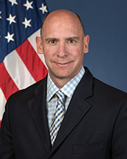

The Intelligent Transportation Systems Joint Program Office (ITS JPO) is excited to welcome Brian Cronin as Acting Director. Having served 11 years in the ITS JPO, Brian is a recognized ITS leader, and his passion for innovation and collaboration position him well to help stakeholders deploy ITS solutions at scale.

Prior to this appointment as Acting Director, Brian served as Director, Office of Safety and Operations Research and Development, Federal Highway Administration, for five years, and Director, Office of Operations Research and Development, for two years. In his most recent role, he provided executive leadership and guidance for improving and advancing transportation safety and operations-related technologies and innovations through research, development, and testing.

During his previous time with the ITS JPO, Brian served as the ITS Research Team Leader, where he provided strategic leadership and direction in the development of ITS solutions to improve transportation mobility, safety, and the environment. He holds a Master’s Degree in Civil Engineering from Texas A&M University and a Bachelor’s Degree in Civil Engineering from Virginia Tech. Brian is also a licensed Professional Engineer in the State of Maryland.
