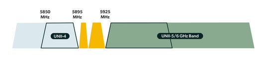

### Tuesday, April 23, 2024 | 3:15 pm to 5:15 pm (MT) | Room 102C

Come and participate in a discussion with the U.S. Department of Transportation (U.S. DOT) about the Federal Communications Commission (FCC)’s 5.9 GHz Second Report & Order that seeks to establish the technical and operational rules for the 30 MHz Intelligent Transportation Systems (ITS) Band.

Based on the First Report & Order’s Further Notice of Proposed Rulemaking, the FCC has asked questions about:

-   Out of band emission (OOBE) interference — UNII-5 and UNII-4—and how best to protect the ITS Band 30 MHz
-   Channel Plan — 20 MHz + 10 MHz
-   Standards
-   Geofencing for coexistence with Federal Systems
-   Long-Term Evolution Vehicle-to-Everything (LTE-V2X) device parameters (power, OOBE, antenna height)
-   Message Priority
-   Limiting 30 MHz to “safety of life” vs “safety-related” vs broader
-   Equipment Certification/Authorization by FCC vs OmniAir
-   Dedicated Short-Range Communications Rules
-   Additional Spectrum
-   Filing of additional waivers

As the U.S. DOT prepares input to the FCC (through the National Telecommunications and Information Administration), we are interested in your thoughts, concerns, and questions on these (and other) topics. Contact Justin Anderson, V2X Program Manager for more information at [justin.anderson@dot.gov](mailto:justin.anderson@dot.gov).

