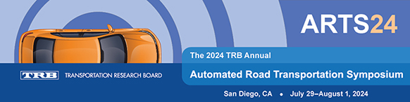

The 2024 Automated Road Transportation Symposium (ARTS24) will offer 24 interactive, “deep-dive” breakout sessions designed to be collaborative to stimulate discussion and brainstorm ideas. The breakouts include all professional levels, from C-Suite executives and U.S. Department of Transportation staff to summer interns. The focus of the sessions will span three subject areas—policy, operations, and safety.

### BREAKOUT SESSIONS

The following are the breakout sessions related to **operations**. Stay tuned for information on breakout sessions related to **policy** and **safety**.

-   [**Autonomous Vehicles in a Data Wonderland**](https://trb.secure-platform.com/a/solicitations/160/sessiongallery/schedule/items/1939)
-   **[Unravelling the Route Map to Future Automated Transit Bus Service](https://trb.secure-platform.com/a/solicitations/160/sessiongallery/schedule/items/1940)**
-   **[Automating the Future: CDA Deployment Plan for Safer, Smarter Mobility!](https://trb.secure-platform.com/a/solicitations/160/sessiongallery/schedule/items/1942)**
-   **[Guess What?! Using Digital Twins and Digital Infrastructure to Advance Safety and Mobility](https://trb.secure-platform.com/a/solicitations/160/sessiongallery/schedule/items/1943)**
-   **[Large Model for Automated Vehicle Impacts Analysis and Evaluation](https://trb.secure-platform.com/a/solicitations/160/sessiongallery/schedule/items/1938)** 
-   **[Federal Automation Grant Programs and ADS Grant Update](https://trb.secure-platform.com/a/solicitations/160/sessiongallery/schedule/items/1944)**
-   **[Automated Freight and Trucking](https://trb.secure-platform.com/a/solicitations/160/sessiongallery/schedule/items/1960)**
-   **[Flashing Lights, Caution Tape, and Things in the Road! OH MY! A Workshop on ADS and Urban Road Challenges](https://trb.secure-platform.com/a/solicitations/160/sessiongallery/schedule/items/1946)**
-   **[Business and Governance Models Over the World: An Open Forum on Success Factors and Expectations](https://trb.secure-platform.com/a/solicitations/160/sessiongallery/schedule/items/1947)**
-   **[National Models for Collaboration in Digital Infrastructure for ADS Integration](https://trb.secure-platform.com/a/solicitations/160/sessiongallery/schedule/items/1959)**

For more information and registration details, visit: [**https://trb.secureplatform.com/a/page/AutomatedRoadTransportationSymposium**](https://trb.secure-platform.com/a/page/AutomatedRoadTransportationSymposium).

