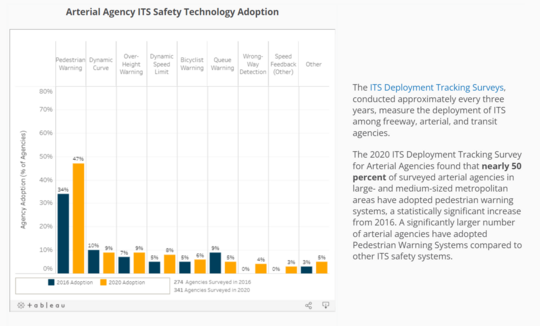

The U.S. Department of Transportation’s (U.S. DOT) Intelligent Transportation Systems (ITS) Joint Program Office (JPO) has launched a new ITS for Pedestrian Safety Data Story exploring the challenges of pedestrian safety and how ITS technologies can be a valuable tool in addressing those challenges. This new feature uses data from the ITS Benefit, Costs, and Lessons Learned databases, the ITS Deployment Tracking Survey, and the National Highway Traffic Safety Administration’s Fatality and Injury Reporting System dataset, allowing users to explore and interact with charts and maps to see how ITS can be part of the solution for improving pedestrian safety.

The new feature allows users to see what agencies are deploying ITS safety technologies, the benefits they provide, the cost of different ITS solutions, and lessons learned from similar deployments. It also includes links to U.S. DOT resources for addressing pedestrian safety.

The ITS Deployment Evaluation website provides short summaries of benefits, costs and lessons learned for the safety, mobility, and environmental impacts of over 25 years of deployment of ITS technologies. The site contains data on the extent of ITS deployment obtained from surveys of state and local agencies over the last 20 years. It also offers briefings, case studies, data visualizations, and tools to support decision making for ITS investments. You can visit the website homepage here: [**ITS Deployment Evaluation (dot.gov)**](https://www.itskrs.its.dot.gov/).
