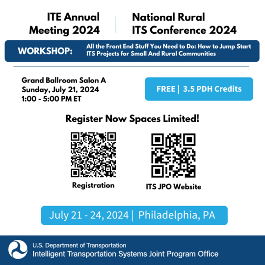

Be sure to join the U.S. Department of Transportation (U.S. DOT) during the Joint Institute of Transportation Engineers (ITE) International and Mid-Colonial District Annual Meeting and Exhibition and the 2024 National Rural Intelligent Transportation Systems (ITS) Conference in Philadelphia for the July 21 workshop.

"Dealing with All the Front-End Stuff: How to Jump Start ITS Projects for Small and Rural Communities” will cover critical topics in the ITS deployment lifecycle, including planning, design, operations, and maintenance specifically focused on rural applications, as well as federal funding opportunities and deployment strategies.

This workshop features a combination of best practices presentations from subject matter experts, success stories, and lessons learned from on–the–ground rural ITS deployments.

Participants will engage in interactive activities and share opportunities and best practices for estimating benefits and outcomes and overcoming challenges such as staffing limitations and required coordination.

Attendees will benefit from Q&A time, peer networking and take-home resources to bring back to their agencies and apply to their work. In turn, U.S. DOT will gather feedback to incorporate into future initiatives and follow-up.

Sign up here, [**2024 Joint ITE International & Mid-Colonial District Annual**.](https://ecommerce.ite.org/imis/iCommerce/Events/Event_Display.aspx?EventKey=ITE2024AM)

Facilitator: **Elina Zlotchenko**, Program Manager, ITS4US and Program Management Office, U.S. DOT ITS Joint Program Office  
Speakers:

-   **Marcia Pincus**, Program Manager, ITS Deployment Evaluation, U.S. DOT ITS Joint Program Office
-   **J.D. Schneeberger**, Program Manager, Knowledge and Technology Transfer, U.S. DOT ITS Joint Program Office
-   **Elina Zlotchenko**, Program Manager, ITS4US and Program Management Office, U.S. DOT ITS Joint Program Office
-   **Susan Wilson**, Program Manager, Rural and Tribal Assistance Pilot Program, U.S. DOT, Build America Bureau

Save your seat, **[2024 Joint ITE International & Mid-Colonial District Annual.](https://ecommerce.ite.org/imis/iCommerce/Events/Event_Display.aspx?EventKey=ITE2024AM)**

Posted 7/1/24
