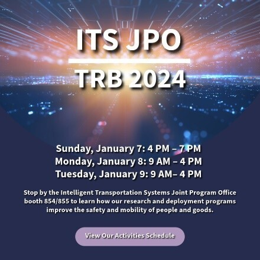

Hello,

During the Transportation Research Board (TRB) Exhibit Hall hours, you’ll be able to stop by our **ITS JPO booth 854/855** to learn more about our research and deployment programs. Make sure to visit [**https://its.dot.gov/trb2024/**](https://www.its.dot.gov/trb2024/index.htm) to view the activities we have planned during TRB.

